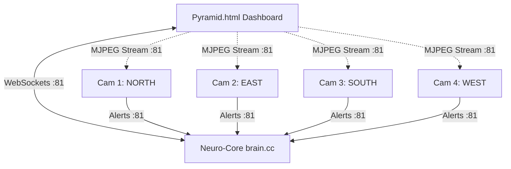

# 🏔️ Pyramid Sentinel: Neural Surveillance Matrix

A high-performance, distributed security ecosystem leveraging ESP32-CAM nodes and a central Neuro-Core for real-time AI-driven threat detection and monitoring.

## 📐 System Architecture

The system follows a hub-and-spoke architecture where the **Neuro-Core** acts as the central intelligence hub, and four **Sentinel Cameras** act as remote sensing nodes.

## 🖥️ Dashboard Interface

### Main Dashboard

*Real-time surveillance dashboard with 4-sector camera feeds, system status tiles, and event logging capabilities.*

### Setup & Configuration

*Quick setup interface for configuring Access Point or Station mode with step-by-step connection guidance.*

## 📡 Networking Grid

| Node | Role | SSID | IP Address | Ports |
| :--- | :--- | :--- | :--- | :--- |
| **Neuro-Core** | Access Point / Hub | `PyramidNet` | `192.168.4.1` | 80 (API), 81 (WS) |
| **Cam 1** | Node (NORTH) | - | `192.168.4.2` | 81 (Stream/WS) |
| **Cam 2** | Node (EAST) | - | `192.168.4.3` | 81 (Stream/WS) |
| **Cam 3** | Node (SOUTH) | - | `192.168.4.4` | 81 (Stream/WS) |
| **Cam 4** | Node (WEST) | - | `192.168.4.5` | 81 (Stream/WS) |

## 🔄 Operational Flow

1.  **Boot Phase**:
    *   **Neuro-Core** initializes WiFi Access Point `PyramidNet` at `192.168.4.1`.
    *   **Sentinel Cameras** connect to `PyramidNet` and establish a WebSocket uplink to the Brain.
2.  **Surveillance Phase**:
    *   Each camera conducts on-device **Face Detection** using its Neural Kernel.
    *   The Brain monitored local **Ultrasonic** and **PIR** sensors.
3.  **Threat Detection**:
    *   If a camera detects a target, it sends an `AI_VERIFIED` alert to the Brain.
    *   **Multi-Sector Threat Fusion**: If 2+ cameras alert within 10 seconds, the Brain escalates to **MAXIMUM OVERDRIVE**.
4.  **Reaction Phase**:
    *   The Brain triggers the **Titanium Siren** and updates its TFT dashboard.
    *   The **Web Dashboard** (`Pyramid.html`) receives a WebSocket update and triggers UI alerts/sounds.
5.  **Monitoring**:
    *   Users view live MJPEG streams directly from each camera node via the dashboard.

## 🧠 Neural Logic Features
*   **Thermal Governor**: Cameras auto-throttle processing if internal temperature exceeds 82°C.
*   **Distributed AI**: Face detection is processed locally on each camera to reduce bandwidth.
*   **Encapsulated State**: The Brain maintains a global `NeuroState` including heartbeats for all nodes.

---
*Created by Syed Daiam.*

